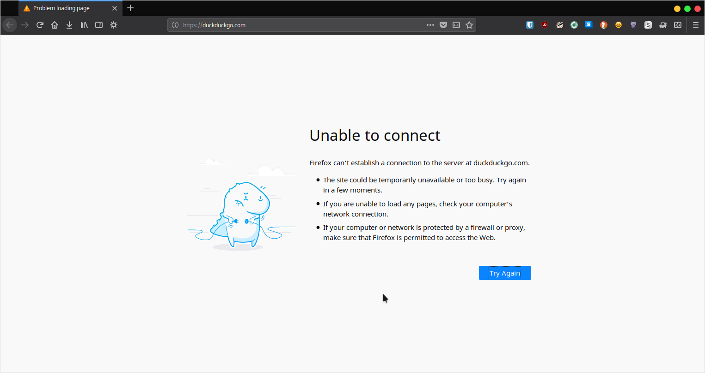
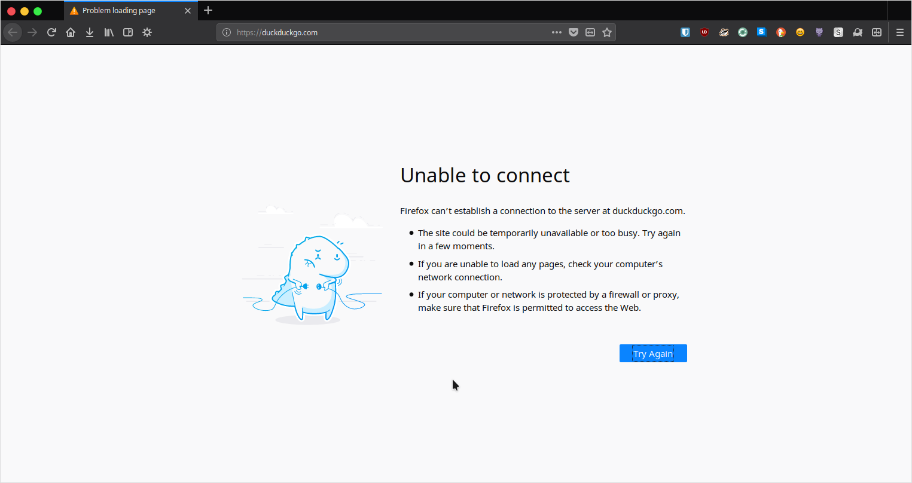
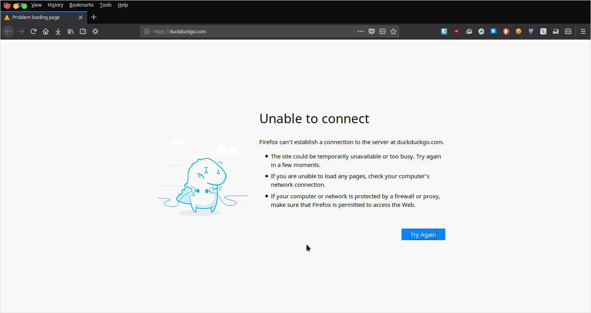
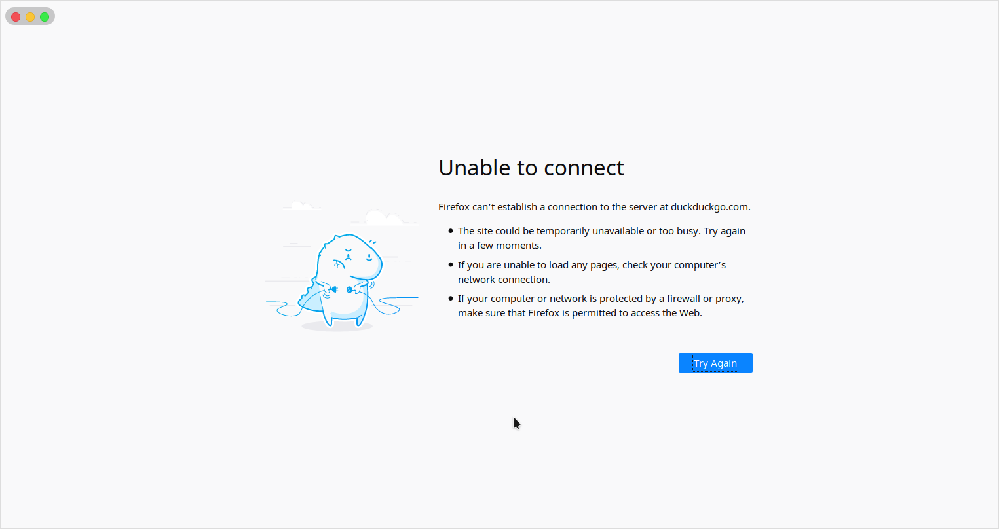
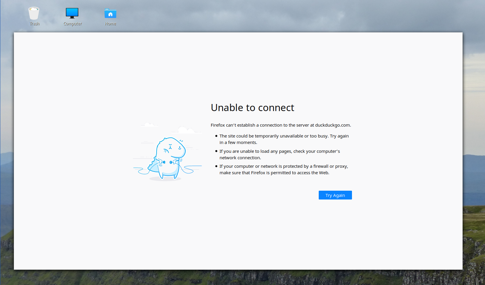

# `userChrome.css` Playground

> Playing around with Firefox's ability to style, relayout or hide browser UI elements with the `userChrome.css` file

# Introducion

All actions were performend on a Linux Mint 19 machine with Firefox 62 and the *McOS Mint Cinnamon* Theme. There are many
macOS-ish themes for various desktop environments out there; they will probably look almost the same with these settings.
The general concept of the `userChrome.css` file applies to Firefox on all operating systems.

Actual pixel values used may vary for your theme!

I thought about what page I should have open when making the screenshots, and while DuckDuckGo is my default page, I just
disconnected from the internet for a little while :wink:

# Enable CSD mode in Firefox

Open the Overflow Menu, go to `Customize...` and uncheck `Title Bar` in the bottom left corner. This will enable the CSD
mode built into Firefox Quantum, effectively hiding the title bar and drawing the window control buttons next to the tabs
- but on the right side, no matter what your OS settings are. Let's fix that.

# Pull the window control buttons to the left side

This tiny bit of CSS is all over the internet, apparently a lot of people want to have both CSD mode enabled and the window
control buttons on the left.

```css
/* Pull window controls to the left when Firefox is in CSD mode to fit my OS settings */
#titlebar-max {
  -moz-box-ordinal-group: 0;
}

#titlebar-content {
  direction: rtl;
}

#TabsToolbar {
  direction: rtl;
}

#tabbrowser-tabs {
  direction: ltr;
}

/*
Since the order of the buttons has been reversed only visually,
apply left margin to the most right button (but first in the markup)
*/
#titlebar-buttonbox > toolbarbutton:first-child {
  margin-left: 6px !important;
}
```

## Before


## After


That looks good, however if you show the menu bar... not anymore. Let's fix that.

# Avoiding overlapping of the window control buttons and the menu bar

I wanted these layout changes to work with the menu bar either shown or hidden.

Just give the menu bar a large enough left margin, and while we're at it, let's add some vertical margin too.

```css
#menubar-items {
  margin-left: 75px;
  margin-top: 3px;
  margin-bottom: 3px;
}
```

## Before


## After


# Give the notification bar some color (optional)

This is both completely random and optional: let's give the notification bar that will slide down e.g. when you are connected
to a hotspot with the need of logging in before accessing the internet.

I believe the default color of the bar is influenced by the theme of your OS.

```css
/* Give notifications (e.g. hotspot login notification) a nice blue background */
notification {
  background: #337dfe !important;
  color: #fff !important;
}
```

## Before


## After


# Hide the window toolbox (tabs, URL/search input etc.)

Let's get minimalistic.

```css
/*
Hide toolbox (everything above the browser view), you'll get just the browser
view and window controls... if you want that :)
WARNING: navigating WILL be difficult!
*/
#navigator-toolbox {
  display: none;
}
```

To move the window I press `Alt` and drag the window with the mouse.

You'll notice there's still a gap at the top of the window, where the controls are. Also the notification bar, if any,
will be overlapped by the controls.

```css
/*
Pull everything below up to hide the gap of the height of the title bar.
NOT required when window controls are hidden (see below).
*/
#content-deck {
  margin-top: -27px;
}

/*
Don't let notifications overlap with the window controls.
NOT required when window controls are hidden (see below).
*/
notificationbox[notificationside="top"] > notification {
  padding-left: 90px !important;
}
```


On a simple light or dark background this looks great, but on a noisy background we may add some more contrast.

# Style the window control buttons container - Style 1

```css
/* Style window controls box as you wish */
#titlebar-buttonbox {
  background: rgba(0, 0, 0, 0.2);
  padding: 0 5px;
  border-radius: 15px;
  /* Vertical offset, doesn't work nicely with margin-top */
  transform: translateY(10px);
}
```



# Style the window control buttons container - Style 1

```css
#titlebar-buttonbox {
  background: rgba(0, 0, 0, 0.2);
  padding: 0 5px;
  margin-left: -7px;
  border-bottom-right-radius: 15px;
}
```


# Hide the window controls

...and nothing will be left. Well, except for the browser view and possibly a notification bar (which you could hide too,
of course).

At this point you got yourself something like a "fullscreen-browser in windowed mode". Remember to remove the negative
margin on `#content-deck` and the padding for the notification bar from above.

```css
#titlebar-buttonbox {
  /* Hide window controls (it's basically a "fullscreen-browser in windowed mode" at this point) */
  display: none;
}
```


